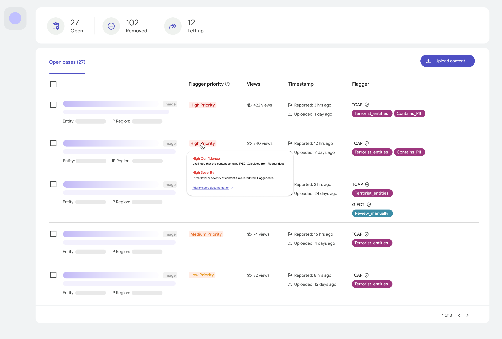
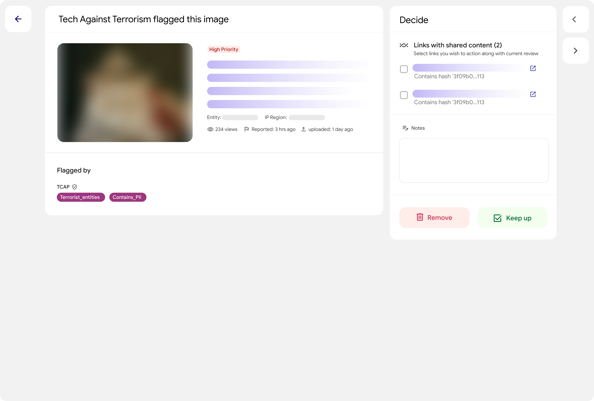
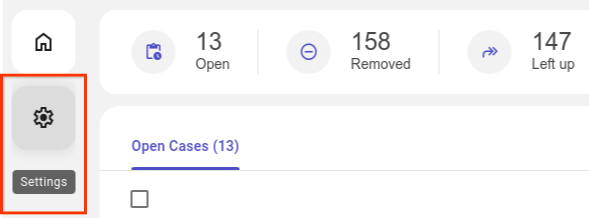

# Altitude

Altitude is a web application that helps you triage and make decisions on
flagged content from counter-terrorism databases.
[Read more about how it works](docs/overview.md).

Altitude is publicly available and part of
[Tech Against Terrorism](https://techagainstterrorism.org/).

Platforms can access Altitude directly or work with Tech Against Terrorism to
receive free, bespoke onboarding support, including guided installation,
testing, and feedback, plus they will gain access to a suite of specialist
services for members. [Learn more.](https://techagainstterrorism.org/altitude-content-moderation-tool)

Altitude connects to the
[Terrorist Content Analytics Platform](https://www.terrorismanalytics.org/) and
the [GIFCT Hash-Sharing Database](https://gifct.org/hsdb/). You will need login
credentials in order to set up those connections.





## Installation

It's simple to get started and try out the application:

1. **Install prerequisite utilities**

   You will need to install a few tools before you can get started:

   - **[Git](https://git-scm.com/):** Follow
     <https://github.com/git-guides/install-git>.

   - **[GNU Make](https://www.gnu.org/software/make/):** Run the commands
     specific to your platform:

     - **Linux:**

       ```sh
       sudo apt-get install build-essential
       ```

     - **Mac:**

       ```sh
       xcode-select --install
       ```

     - **Windows:**

       ```sh
       winget install -e --id GnuWin32.Make
       ```

   - **[Docker](https://docker.com/):** Install Docker Desktop from
     <https://docs.docker.com/get-docker/>.

1. **Clone this repository**

   ```sh
   git clone https://github.com/Jigsaw-Code/platform-defender
   cd platform-defender
   ```

1. **Configure and run the stack locally.**

   ```sh
   make PROD build start
   ```

   You will be prompted to provide credentials to start up a database.

   <!-- markdownlint-disable MD028 -->

   > [!TIP]
   > If you wish to use a port other than the default (`8080`), set the `PORT`
   > environment variable, e.g. `PORT=1234 make PROD build start`

   > [!TIP]
   > If you wish to serve the application on a subpath (e.g.
   > `www.example.com/foo/bar/` instead of `www.example.com`), set the
   > `SERVE_PATH` environment variable, e.g.
   > `SERVE_PATH=/foo/bar/ make PROD build start`

   <!-- markdownlint-enable MD028 -->

1. **Connect API sources.**

   Once installed and running, you can load the web frontend at
   <http://localhost:8080> (or your chosen port). Start out by configuring the
   tool by specifying which signal sources to connect to:

   

1. **Upload target content into the system.**

   Data that you wish to be in scope of the tool can be submitted as _target_
   entities through a RESTful API. To create a new image _target_, you need to
   provide the content and its type. You can do something as simple as:

   ```shell
   curl -H "Content-Type: application/json" \
       --data '{"client_context": "abc", "content_type": "IMAGE", "content_bytes": "R0lGODlhAQABAAAAACH5BAEKAAEALAAAAAABAAEAAAICTAEAOw=="}' \
       "http://localhost:8080/api/targets/"
   ```

   You can provide such as author metadata, to ensure moderators have as much
   context as needed during review. Consult the [OpenAPI spec](./api.yml) and
   [documentation](https://redocly.github.io/redoc/?url=https://raw.githubusercontent.com/Jigsaw-Code/altitude/main/api.yml)
   for more options.

## Further integration

All decisions made in the tool are logged to dated files under
`./signal-service/logs/tasks/verdict-notifier`, so it's easy to evaluate the
output. If you wish to receive updates of verdicts for automated processing, you
can configure an endpoint on your server and provide it as a webhook when
deploying the tool using the `ACTION_RECEIVER_URL` environment variable, e.g.:

```sh
ACTION_RECEIVER_URL=http://my-domain.com/verdicts/webhook make PROD build start
```

We send all decisions to this endpoint and will retry 5 times across 30 or so
minutes before giving up. This endpoint must be able to receive a JSON with the
following [JSON Schema](https://json-schema.org/):

```js
{
    "type": "object",
    "properties": {
        "client_context": {
            "type": "string",
            "description": "An opaque string that you provided when the entity was initially created, or a URL."
        },
        "decision": {
            "type": "string",
            "enum": ["APPROVE", "BLOCK"]
        },
        "decision_time": {
            "type": "string",
            "format": "date-time"
        }
    }
}
```

## Questions?

Check out our [FAQ](docs/faq.md).

## Contributing

See [`CONTRIBUTING.md`](CONTRIBUTING.md) for details.

## License

Apache 2.0; see [`LICENSE`](LICENSE) for details.
