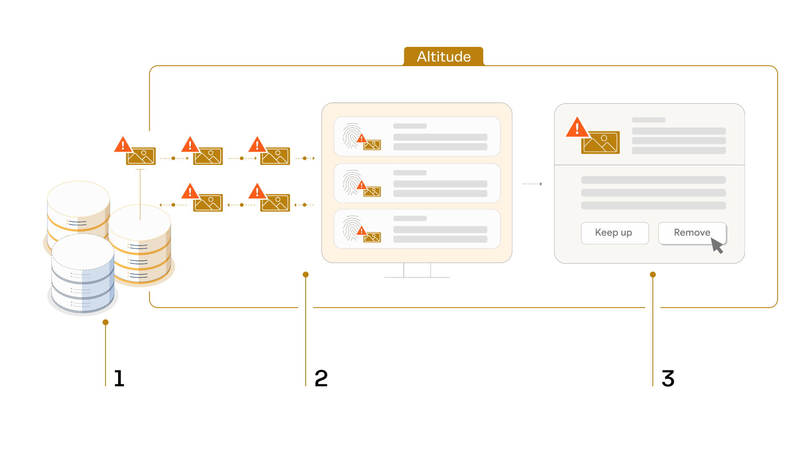
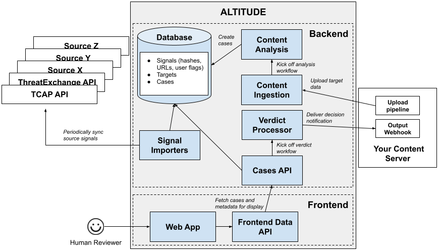

# Overview

## How it works

### 1. Identification

Trusted sources identify and flag terrorist and violent extremist content (TVEC)
using their own methods:

- [Terrorist Content Analytics Platform](https://www.terrorismanalytics.org/)
  (TCAP) by Tech Against Terrorism

- [Hash-Sharing Database](https://gifct.org/hsdb/) (HSDB) by Global Internet
  Forum to Counter Terrorism (GIFCT)

### 2. Matching

Altitude integrates with each of the trusted sources, and consolidates their
TVEC signals into one view.

Platforms install Altitude, instead of checking each individual source
separately.

Platforms use Altitude to check whether any content on their platform matches
the flagged content that’s been consolidated into Altitude.

### 3. Review & Action

When there’s a match that needs review, small platform moderators click for more
detail, review and choose what action they want to take on the content.

## Architecture

### Entities

#### Target

The thing that clients are concerned about and want to “target”, i.e. bring in
scope of the system. For example, an image.

Targets are represented as a collection of features. Some of those features are
provided by the client (e.g. the raw bytes), while others are fetched or
calculated later (e.g. OCR'ed text from an image).

#### Signal

An input from an external or an internal source that can be used to identify
new content for review.

An external source could be URLs provided by TCAP or an ML model that detects
violent content. An internal source could be a previously reviewed piece of
“bad” content.

#### Case

A request for a human to visualize a target and its features, and to generate a
review.

#### Review

A single action taken by a human on a case.
